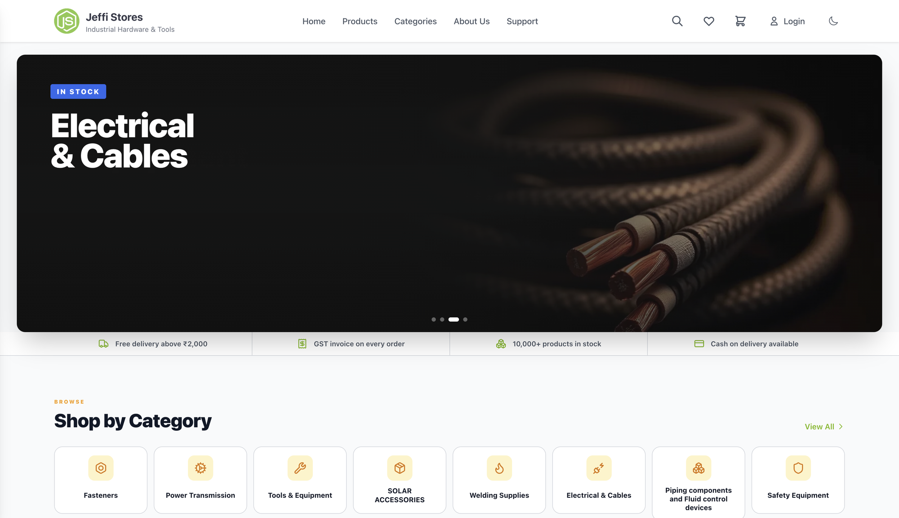

# Jeffi Stores



E-commerce platform powering [jeffistores.in](https://jeffistores.in), an industrial-hardware store,
and the multi-tenant SaaS that runs stores for other merchants. Next.js on AWS, with a full admin
panel, Razorpay payments, GST invoicing and Delhivery shipping.

```bash
npm install
npm run dev     # storefront on :3000, admin at /admin
```

- [Project overview](docs/PROJECT_OVERVIEW.md) — stack, layout, local setup, deployment, environment variables
- [Multi-tenant status](docs/SAAS_MULTITENANT_STATUS.md) — authoritative status for tenants and provisioning
- [Releasing](docs/RELEASING.md)

Proprietary — © Jeffi Stores. All rights reserved.
